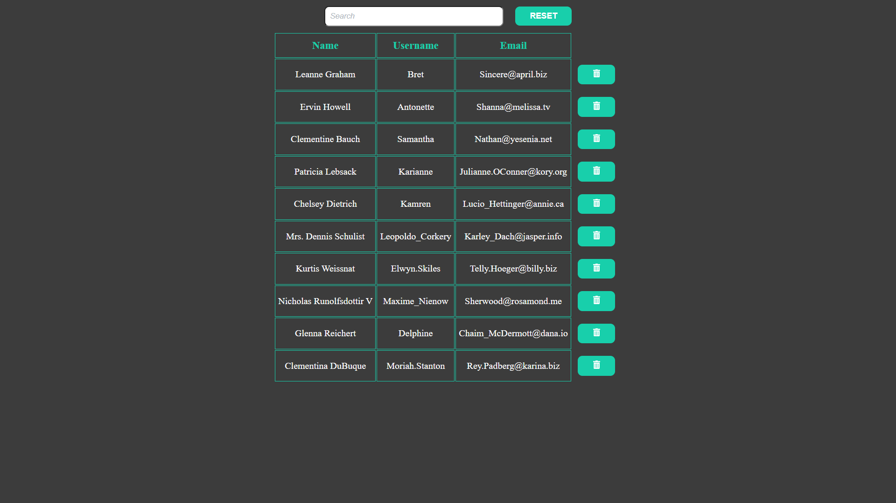

# `List of users on React`

- Loading users from the server
- Adding a button to delete users
- Creating a user search field
- Adding a button to reset users
- Creating a modal window with information about the selected user

 

Сompiled page [Users list](https://users-list-one-flax.vercel.app/?).
